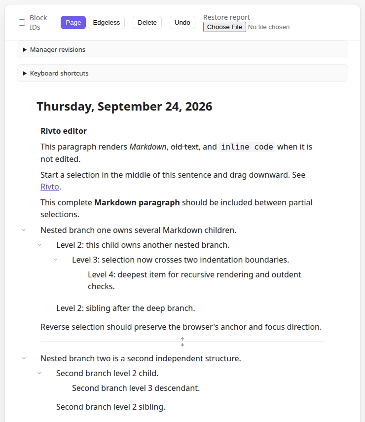
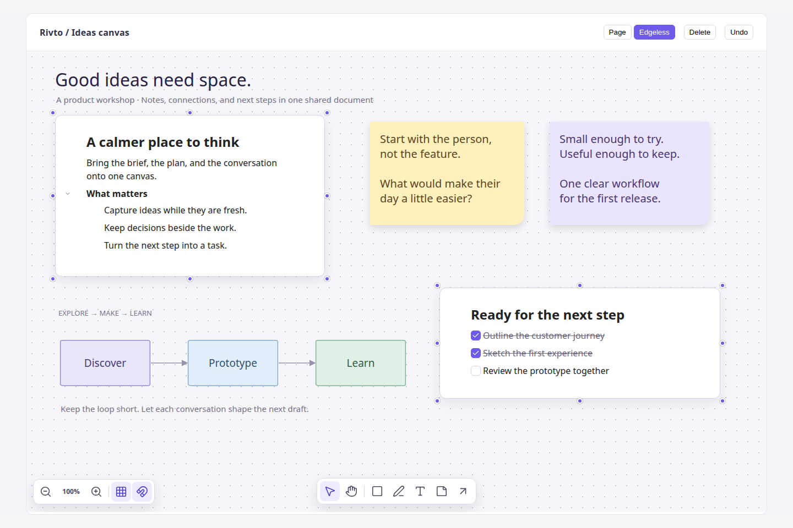
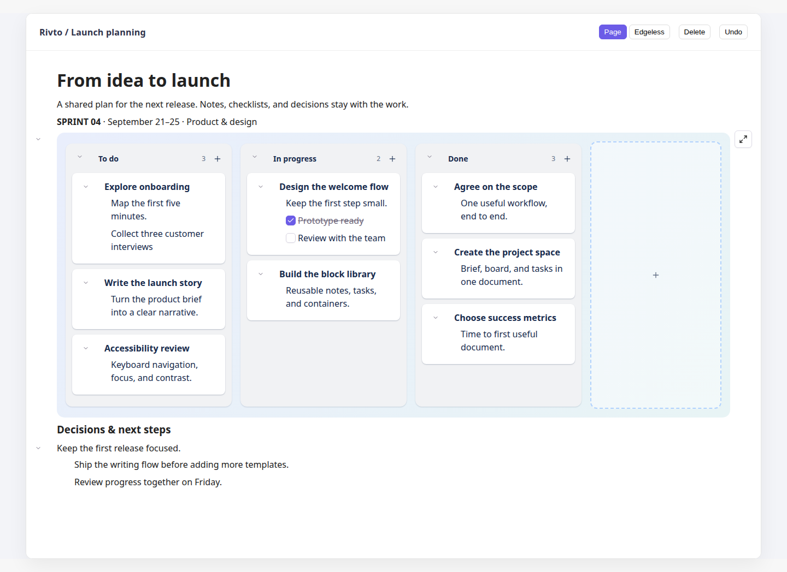
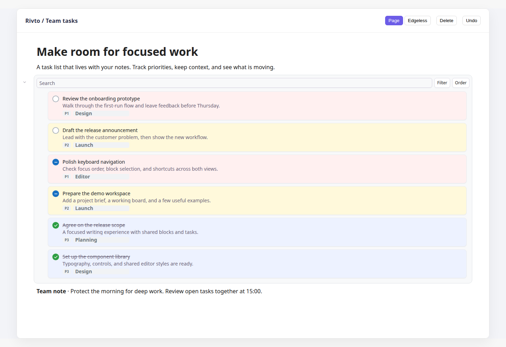

# Rivto editor

A React block editor with nested documents, an edgeless canvas, kanban boards,
and todos, backed by a Yjs collaborative document model. Use the editor as a
library, or use its framework-neutral core with your own view layer.

## Why choose Rivto?

Rivto is a good fit when editing goes beyond a rich-text field:

- **One document, multiple views.** Page and edgeless modes share the same
  blocks. Put document content on a canvas alongside shapes, sticky notes,
  drawings, and connectors without copying it into a separate whiteboard model.
- **Structure beyond paragraphs.** Nest and collapse blocks, move them between
  kanban columns, or compose tables, columns, and bento layouts. These containers
  hold ordinary editable blocks.
- **Collaboration at the data layer.** Yjs handles shared state; document
  invariants, transactions, snapshots, and undo live below React rendering.
- **Custom behavior without forking the editor.** Register block definitions,
  React renderers, slash commands, keyboard bindings, and interaction extensions.
  Page dragging, canvas interactions, and task blocks are opt-in.
- **Separate data and UI ownership.** Reuse the document model and editor
  managers independently of React. Your host controls document lifetime,
  persistence, and synchronization providers.

The advantage over a text-only editor is this combination of structured blocks,
canvas editing, and extensibility. For a simple formatted input, a smaller
text editor may be a better fit. Rivto does not include a hosted collaboration
service; connect storage and remote synchronization for your deployment.

## Demo screenshots

Captured from the editor demo. The canvas, kanban, and todo screenshots use
staged example documents and a wider demo frame, with debugging panels hidden.

### Nested blocks

Markdown rendering and collapsible branches, including four levels of nesting.



### Edgeless canvas

A workshop canvas combining nested document blocks, checklists, sticky notes,
and a connected workflow diagram.



### Kanban

Move editable cards between columns or back into the document outline. Expand
boards when you need more room.



### Todos

Tasks include status, description, priority, and project, with search, filtering,
and ordering in the task collection.



## Requirements

| Use | Requirements |
| --- | --- |
| React integration | React and React DOM **18 or 19**, Yjs **13**, and a bundler that supports ES modules and CSS imports. |
| Browser | A modern browser with DOM selection, Clipboard APIs, and `crypto.randomUUID()`. Serve through HTTPS or localhost for secure-context APIs. |
| Core only | No React dependency; use the document model and CRDT adapter directly. |
| Repository development | Use **Node.js 24** and **pnpm 11.8.0** (the pnpm version is pinned in the root `package.json`). The demo uses Vite 7 and TypeScript 5.8. |
| Browser tests | Playwright Chromium and Firefox; install them with `pnpm exec playwright install chromium firefox`. |

Import the editor stylesheet once. Published styles are precompiled; a consuming
project does not need to configure Tailwind. The source demo compiles styles
with its existing Tailwind/Vite setup. Mount the React editor on the client.

## Install

Install the editor and the packages used to create its document:

```sh
pnpm add @chulane/rivto @chulane/rivto-react @chulane/document-model @chulane/crdt-doc yjs@^13 react@^19 react-dom@^19
```

If your project already uses React 18 or 19, keep its existing React versions.
The package directories and public names differ; see the package map below.

### Create a React editor

```tsx
import { useEffect, useState } from "react";
import { YjsDoc } from "@chulane/crdt-doc";
import { DocumentModelImpl } from "@chulane/document-model";
import { createRivtoEditor } from "@chulane/rivto";
import {
  createReactEditor,
  EditorView,
  standardPreset,
  type ReactEditor,
} from "@chulane/rivto-react";
import "@chulane/rivto-react/styles.css";

export function DocumentEditor() {
  const [view, setView] = useState<ReactEditor | null>(null);

  useEffect(() => {
    const document = new DocumentModelImpl(new YjsDoc(crypto.randomUUID()));
    const editor = createRivtoEditor();
    editor.setDocument(document);
    const reactEditor = createReactEditor({
      editor,
      extensions: [standardPreset()],
    });
    editor.blocks.insertBlock({ type: "paragraph", content: "Hello **Rivto**!" });
    setView(reactEditor);

    return () => {
      reactEditor.destroy();
      void editor.destroy().finally(() => document.destroy());
    };
  }, []);

  return view ? <EditorView reactEditor={view} /> : null;
}
```

The core starts unbound: attach a `DocumentModelImpl` with `setDocument` before
editing. Mutate content through managers such as `editor.blocks` and
`editor.elements`. The host owns the document and destroys it after its views
and editor sessions are finished using it.

To enable the demo's optional features, import `pageDragExtension`,
`edgelessPreset`, `edgelessVisualsExtension`, and `todoItemExtension` from
`@chulane/rivto-react` and use:

```ts
extensions: [
  standardPreset(),
  pageDragExtension(),
  ...edgelessPreset(),
  edgelessVisualsExtension(),
  todoItemExtension(),
]
```

Switch the view with `reactEditor.mode.set("edgeless")` or
`reactEditor.mode.set("block")`. See [the demo setup](demo/src/App.tsx) for
container creation, a mode toolbar, custom blocks, and synchronization.

## Run the demo

```sh
git clone https://github.com/MalchuL/rivto.git
cd rivto
pnpm install --frozen-lockfile
pnpm demo
```

Open **http://localhost:5173**, or the URL Vite prints if that port is busy.
The demo imports workspace TypeScript sources, so no package build is needed
before starting it. Source changes hot-reload.

1. Start in **Page** mode to explore nested blocks, Markdown, and slash commands
   (type `/` inside a writing block).
2. Scroll down for the table, kanban, columns, bento layout, and todo collection.
   Use a kanban's expand control for a larger board.
3. Select **Edgeless** to explore document cards and canvas tools.
4. Uncheck **Block IDs** for a cleaner view like the screenshots above.

Additional demo routes:

| URL | What it demonstrates |
| --- | --- |
| `/?sync=1&room=my-room` | Two editors synchronized through BroadcastChannel. Open the same URL in another tab on the same browser/origin to join; no server is needed. |
| `/?editors=2` | Independent documents for cross-document dragging and selection. |
| `/?repeat=10` | Additional seeded document content for exploration. |

The default demo creates fresh in-memory documents on reload. BroadcastChannel
shows local synchronization; it does not connect users on different computers.

To build and preview the demo:

```sh
pnpm demo:build
pnpm --dir demo preview
```

Vite prints the preview URL. Build output is in `demo/dist/`.

## Package map

The main dependency chain is:

```text
@chulane/rivto-react → @chulane/rivto → @chulane/document-model → @chulane/crdt-doc
React and browser UI   Editor behavior   Persisted document       CRDT adapter
```

| Directory | Package | Responsibility |
| --- | --- | --- |
| `packages/crdt-doc/` | `@chulane/crdt-doc` | Adapter-neutral CRDT contracts, Yjs adapter, shared values, and synchronization providers. Native Yjs imports stay here. |
| `packages/document-model/` | `@chulane/document-model` | Canonical blocks, hierarchy, canvas elements, plugin data, transactions, and snapshots. |
| `packages/rivto-editor-core/` | `@chulane/rivto` | Framework-neutral commands, selection, clipboard, editor modes, and undo managers. |
| `packages/react-rivto-editor/` | `@chulane/rivto-react` | React renderers and hooks, page/canvas surfaces, DOM selection and events, keyboard handling, slash commands, and extensions. |
| `packages/graph-runtime/` | `@chulane/graph-runtime` | Optional headless graph execution, endpoint registration, value propagation, and slot flows. |
| `packages/block-graph/` | `@chulane/block-graph` | Optional block-oriented bindings on top of the graph runtime. |

The graph packages are separate from the normal editor setup. `demo/` is the
interactive integration playground, `e2e/` contains browser tests, and `docs/`
and `dev_notes/` contain reference material and tutorials.

## Development checks

Run from the repository root:

```sh
pnpm demo:check                         # Demo TypeScript check
pnpm check-types                        # Workspace TypeScript checks
pnpm lint                               # Editor package lint
pnpm test                               # CRDT, model, graph, and core tests
pnpm --filter @chulane/rivto-react test   # React tests
pnpm exec playwright install chromium firefox
pnpm test:e2e                           # Builds demo, then tests both browsers
pnpm build                              # Package outputs and documentation site
```

## Further reading

- [React managers and extension lifecycle](packages/react-rivto-editor/docs/managers.md)
- [Custom block rendering with useBlockEditing](packages/react-rivto-editor/docs/use-block-editing.md)
- [Events and keyboard bindings](packages/react-rivto-editor/docs/events.md)
- [Page and edgeless selection](packages/react-rivto-editor/docs/selection.md)
- [Edgeless elements and document projection](packages/react-rivto-editor/docs/edgeless-elements.md)
- [Markdown rendering](packages/react-rivto-editor/docs/markdown-rendering.md)
- [Tutorials](dev_notes/tutorials/README.md)
